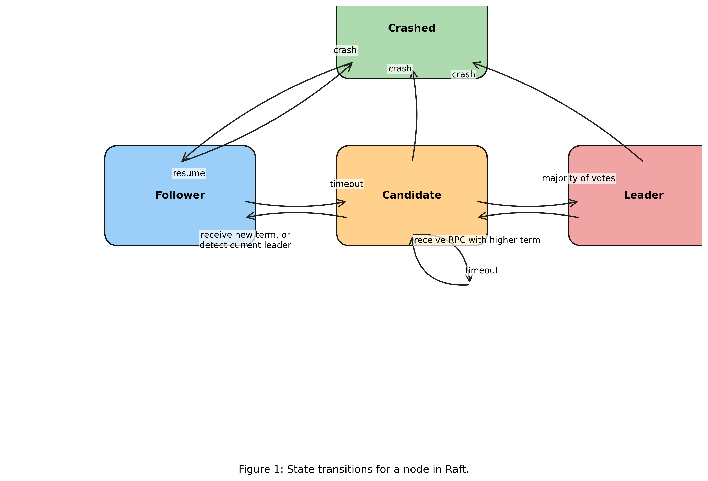

# Verification Results Visualization

This directory contains scripts and graphs visualizing the performance and scaling characteristics of the Raft consensus algorithm verification using the SPIN model checker.

## Generated Graphs

The following graphs have been generated from the verification data in the main report:

1. **state_vector_size.png** - Shows the linear growth of state vector size with increasing server count
2. **memory_consumption.png** - Visualizes memory requirements scaling with server configurations
3. **verification_performance.png** - Compares verification speeds between 5-server and 20-server configurations across property types
4. **performance_degradation.png** - Displays the performance degradation factors for different property types
5. **performance_trends.png** - Shows comprehensive verification speed trends across all server configurations

## Raft State Diagram



This diagram illustrates the state transitions for a node in the Raft consensus algorithm. It was created using matplotlib and provides a clear visualization of how nodes transition between Follower, Candidate, Leader, and Crashed states based on various events in the distributed system.

To regenerate this diagram:

```bash
python raft_state_diagram.py
```

## How to Regenerate the Graphs

To regenerate these graphs:

1. Ensure you have Python 3.x installed on your system
2. Set up a virtual environment (optional but recommended):
   ```bash
   python3 -m venv venv
   source venv/bin/activate  # On Unix/MacOS
   # or
   venv\Scripts\activate  # On Windows
   ```
3. Install the required packages:
   ```bash
   pip install matplotlib numpy
   ```
4. Run the generation script:
   ```bash
   python generate_graphs.py
   ```

The script will regenerate all five graph images in this directory.

## Data Sources

The data visualized in these graphs comes from the verification results presented in Section 5.2 of the main report. Specifically:

- State vector sizes and memory consumption from Table 3
- Verification speeds from Tables 4, 5, and 6
- Performance degradation factors from Table 7

## Incorporating in LaTeX

To include these visualizations in your LaTeX document:

1. Ensure the `graphs` directory is in the same directory as your main LaTeX file
2. Include the provided LaTeX template:
   ```latex
   \input{graphs/verification_results_graphs.tex}
   ```

Alternatively, you can include individual graphs using:

```latex
\begin{figure}[htbp]
    \centering
    \includegraphics[width=0.8\textwidth]{graphs/state_vector_size.png}
    \caption{Caption text here}
    \label{fig:my-label}
\end{figure}
```

## Customization

To customize these graphs (colors, labels, etc.), edit the `generate_graphs.py` script. Each graph is created in a separate code block within the script, making it easy to modify individual visualizations.
